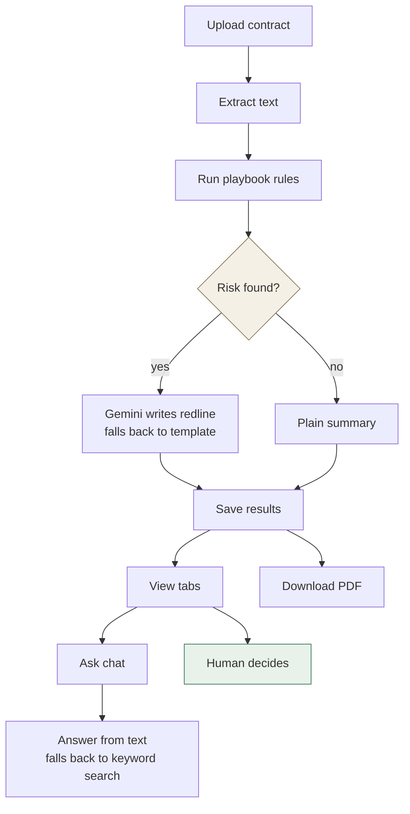

# ClauseGuard

Contracts pile up faster than anyone wants to read them line by line. ClauseGuard reads them for you: upload a vendor contract or a customer agreement and it flags the risky clauses, explains why, and tells you whether to sign, push back, or send it to a lawyer.

It's built for small teams without in-house counsel — the kind of place where contract review currently means either skimming the whole thing or pasting it into ChatGPT and hoping for the best.

## What it checks

Every contract runs against a fixed playbook covering the stuff that actually bites people:

- Auto-renewal clauses with no real opt-out window
- Uncapped or one-sided liability
- Indemnification that only runs one way
- Payment terms, IP ownership, confidentiality, governing law, data privacy, assignment, non-compete

Each finding comes with a risk level (Low / Medium / High / Critical), the exact excerpt that triggered it, a recommended next action, and — for anything Medium or above — a suggested redline. You can also ask it questions about a specific contract in plain English and it'll answer from the actual text, not a guess.

Detection is rule-based, not model-based, so every flag traces back to something you can inspect. The LLM (Gemini) only gets used for writing prose — redlines and chat answers — never for deciding what counts as risky.

## How it works



Detection never touches the network — it's regex against a rule table, so it's the same speed and the same answer every time. The model only shows up where the job is writing sentences, and the actual sign/negotiate/escalate call always stays with a person.

## Running it

```bash
git clone https://github.com/Aduda-Shem/clauseguard.git
cd clauseguard
cp backend/.env.example backend/.env
docker-compose up
```

Open http://localhost:5174, sign up with any username and password (8+ characters, no email verification), and start uploading contracts. Everything's scoped to your account.

A `GEMINI_API_KEY` in `backend/.env` is optional. Without one, redlines and chat fall back to deterministic templates instead of a live model call — risk detection works the same either way.
